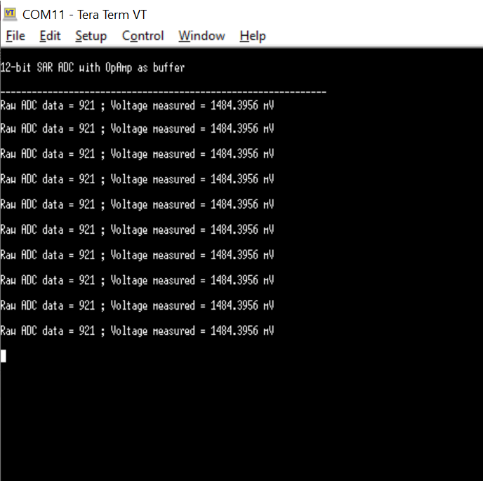
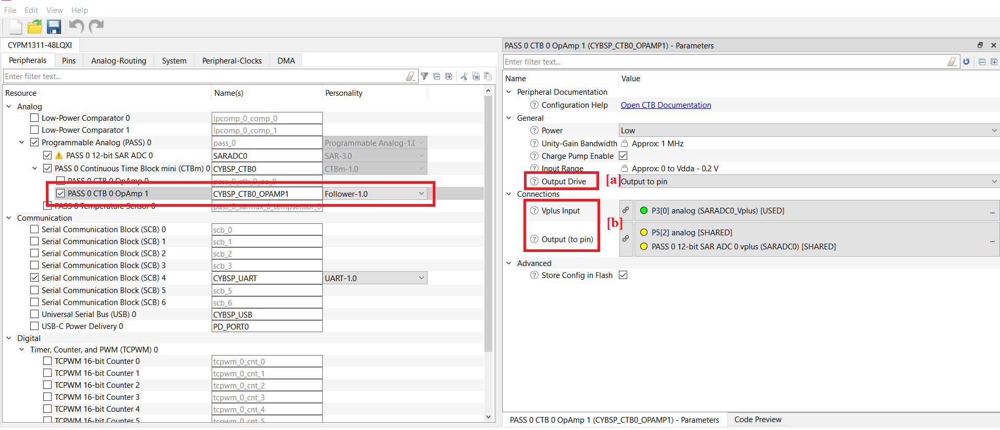
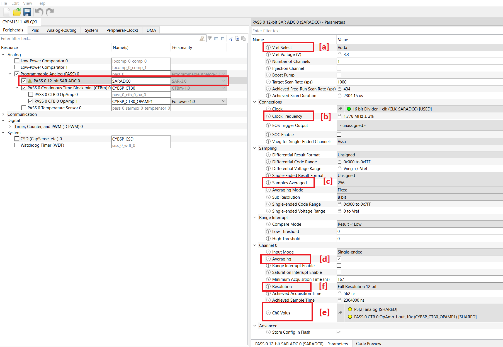
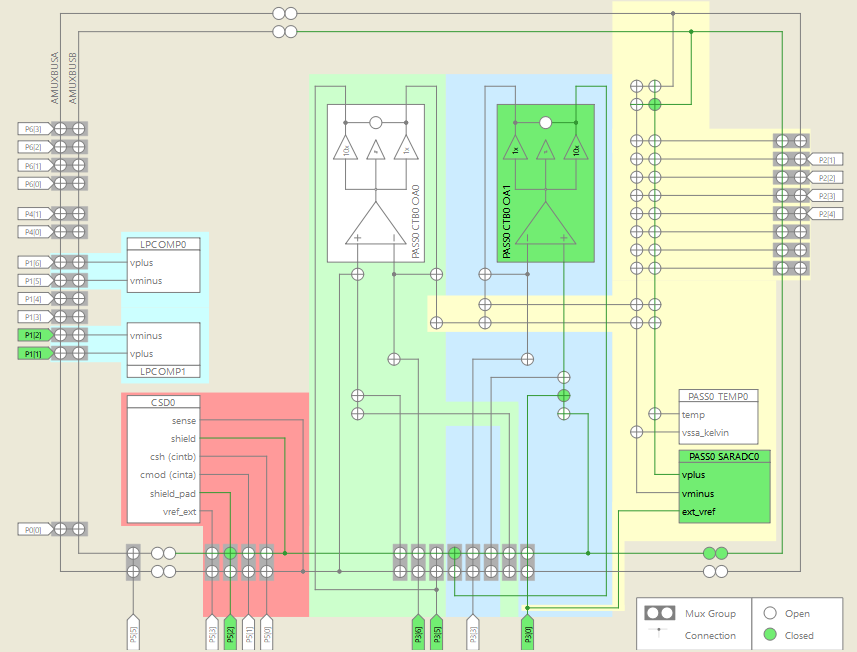

# EZ-PD&trade; PMG1 MCU: 12-bit SAR ADC with opamp as buffer

This code example demonstrates the use of opamp as a buffer along with 12-bit SAR ADC on EZ-PD&trade; PMG1-S3 MCU. The opamp is configured to act as a buffer between external signals and input channels of a 12-bit SAR ADC to provide impedance matching for high-impedance signals. The measured signal is then printed on the UART terminal.


[View this README on GitHub.](https://github.com/Infineon/mtb-example-pmg1-opamp-buffer-saradc)

[Provide feedback on this code example.](https://cypress.co1.qualtrics.com/jfe/form/SV_1NTns53sK2yiljn?Q_EED=eyJVbmlxdWUgRG9jIElkIjoiQ0UyMzgzNDkiLCJTcGVjIE51bWJlciI6IjAwMi0zODM0OSIsIkRvYyBUaXRsZSI6IkVaLVBEJnRyYWRlOyBQTUcxIE1DVTogMTItYml0IFNBUiBBREMgd2l0aCBvcGFtcCBhcyBidWZmZXIiLCJyaWQiOiJwcnl4IiwiRG9jIHZlcnNpb24iOiIxLjAuMCIsIkRvYyBMYW5ndWFnZSI6IkVuZ2xpc2giLCJEb2MgRGl2aXNpb24iOiJNQ0QiLCJEb2MgQlUiOiJXSVJFRCIsIkRvYyBGYW1pbHkiOiJUWVBFLUMifQ==)

## Requirements

- [ModusToolbox&trade;](https://www.infineon.com/modustoolbox) v3.0 or later (tested with v3.0)
- Board support package (BSP) minimum required version: 3.0.0
- Programming language: C
- Associated parts: [EZ-PD&trade; PMG1-S3 MCU](https://www.infineon.com/PMG1)


## Supported toolchains (make variable 'TOOLCHAIN')

- GNU Arm&reg; Embedded Compiler v10.3.1 (`GCC_ARM`) - Default value of `TOOLCHAIN`
- Arm&reg; Compiler v6.16  (`ARM`)
- IAR C/C++ Compiler v9.30.1 (`IAR`)

## Supported kits (make variable 'TARGET')

- [EZ-PD&trade; PMG1-S3 Prototyping Kit](https://www.infineon.com/CY7113) (`PMG1-CY7113`) – Default value of `TARGET`


## Hardware setup

1. Connect the board to your PC using a USB cable through the KitProg3 USB connector (J1). This cable is used for programming the EZ-PD&trade; PMG1 device and can be used during debugging. In addition, it transfers the UART data from the serial port to the PC to display it on a serial monitor.

2. Connect the USB PD port (J10) to a USB-C power adapter/USB port on the PC using a Type-C/Type-A to Type-C cable to power the EZ-PD&trade; PMG1 device for normal operations.

3. For EZ-PD&trade; PMG1-S3 kits of revision 3 or lower, connect the UART Tx (J6.10), and UART Rx (J6.9) lines from the EZ-PD&trade; EZ-PD&trade; PMG1 kit to J3.8 and J3.10 on KitProg3 respectively to establish a UART connection between the KitProg3 and the EZ-PD&trade; PMG1 device. Kits with a higher revision have UART lines internally connected and therefore, external wiring is not required.

4. Configure the CTBm 0 block as a Follower to work in a buffer mode as shown in **Figure 1**.

**Figure 1. Opamp in Follower configuration**


   a. Connect the voltage signal to be buffered to opamp Vplus (P3.0).

   > **Note:** Used variable DC power supply to provide input voltage in this example.

4. ADC is configured as unsigned single-ended. opamp output and ADC pins are connected through AMUXBUS, therefore, no need for an external connection.
   See the [12-bit ADC configuration](#12-bit-adc-configuration).


See the kit user guide for details on configuring the board.


## Software setup

Install a terminal emulator to display the serial data. Instructions in this document use [Tera Term](https://ttssh2.osdn.jp/index.html.en).


## Using the code example

Create the project and open it using one of the following:

<details><summary><b>In Eclipse IDE for ModusToolbox&trade;</b></summary>

1. Click the **New Application** link in the **Quick Panel** (or, use **File** > **New** > **ModusToolbox&trade; Application**). This launches the [Project Creator](https://www.infineon.com/ModusToolboxProjectCreator) tool.

2. Pick a kit supported by the code example from the list shown in the **Project Creator – Choose Board Support Package (BSP)** dialog.

   When you select a supported kit, the example is reconfigured automatically to work with the kit. To work with a different supported kit later, use the [Library Manager](https://www.infineon.com/ModusToolboxLibraryManager) to choose the BSP for the supported kit. You can use the Library Manager to select or update the BSP and firmware libraries used in this application. To access the Library Manager, click the link from the **Quick Panel**.

   You can also just start the application creation process again and select a different kit.

   If you want to use the application for a kit not listed here, you may need to update the source files. If the kit does not have the required resources, the application may not work.

3. In the **Project Creator - Select Application** dialog, choose the example by enabling the checkbox.

4. (Optional) Change the suggested **New Application Name**.

5. The **Application(s) Root Path** defaults to the Eclipse workspace which is usually the desired location for the application. If you want to store the application in a different location, you can change the *Application(s) Root Path* value. Applications that share libraries must be in the same root path.

6. Click **Create** to complete the application creation process.

For more details, see the [Eclipse IDE for ModusToolbox&trade; user guide](https://www.infineon.com/MTBEclipseIDEUserGuide) (locally available at *{ModusToolbox&trade; install directory}/docs_{version}/mt_ide_user_guide.pdf*).

</details>

<details><summary><b>In command-line interface (CLI)</b></summary>

ModusToolbox&trade; provides the Project Creator as both a GUI tool and the command-line tool (*project-creator-cli*). The CLI tool can be used to create applications from a CLI terminal or from within batch files or shell scripts. This tool is available in the *{ModusToolbox&trade; install directory}/tools_{version}/project-creator/* directory.

Use a CLI terminal to invoke the "project-creator-cli" tool. On Windows, use the command-line "modus-shell" program provided in the ModusToolbox&trade; installation instead of a standard Windows command-line application. This shell provides access to all ModusToolbox&trade; tools. You can access it by typing `modus-shell` in the search box in the Windows menu. In Linux and macOS, you can use any terminal application.

The "project-creator-cli" tool has the following arguments:

Argument | Description | Required/optional
---------|-------------|-----------
`--board-id` | Defined in the `<id>` field of the [BSP](https://github.com/Infineon?q=bsp-manifest&type=&language=&sort=) manifest | Required
`--app-id`   | Defined in the `<id>` field of the [CE](https://github.com/Infineon?q=ce-manifest&type=&language=&sort=) manifest | Required
`--target-dir`| Specify the directory in which the application is to be created if you prefer not to use the default current working directory | Optional
`--user-app-name`| Specify the name of the application if you prefer to have a name other than the example's default name | Optional

<br>

The following example clones the "[mtb-example-pmg1-opamp-buffer-saradc](https://github.com/Infineon/mtb-example-pmg1-opamp-buffer-saradc)" application with the desired name "MyOpampBufferSarADC" configured for the *PMG1-CY7113* BSP into the specified working directory, *C:/mtb_projects*:

   ```
   project-creator-cli --board-id PMG1-CY7113 --app-id mtb-example-pmg1-opamp-buffer-saradc --user-app-name MyOpampBufferSarADC --target-dir "C:/mtb_projects"
   ```

> **Note:** The project-creator-cli tool uses the `git clone` and `make getlibs` commands to fetch the repository and import the required libraries. For details, see the "Project creator tools" section of the [ModusToolbox&trade; user guide](https://www.infineon.com/ModusToolboxUserGuide) (locally available at *{ModusToolbox&trade; install directory}/docs_{version}/mtb_user_guide.pdf*).

To work with a different supported kit later, use the [Library Manager](https://www.infineon.com/ModusToolboxLibraryManager) to choose the BSP for the supported kit. You can invoke the Library Manager GUI tool from the terminal by using the `make library-manager` command or use the Library Manager CLI tool (library-manager-cli) to change the BSP.

The "library-manager-cli" tool has the following arguments:

Argument | Description | Required/optional
---------|-------------|-----------
`--add-bsp-name` | Name of the BSP that should be added to the application | Required
`--set-active-bsp` | Name of the BSP that should be as active BSP for the application | Required
`--add-bsp-version`| Specify the version of the BSP that should be added to the application if you do not wish to use the latest from manifest | Optional
`--add-bsp-location`| Specify the location of the BSP (local/shared) if you prefer to add the BSP in a shared path | Optional

<br>

The following example adds the PMG1-CY7113 BSP to the already created application and makes it the active BSP for the app:

   ```
   ~/ModusToolbox/tools_3.0/library-manager/library-manager-cli --project "C:/mtb_projects/MyOpampBufferSarADC" --add-bsp-name PMG1-CY7113 --add-bsp-version "latest-v3.X" --add-bsp-location "local"

   ~/ModusToolbox/tools_3.0/library-manager/library-manager-cli --project "C:/mtb_projects/MyOpampBufferSarADC" --set-active-bsp APP_PMG1-CY7113
   ```

</details>

<details><summary><b>In third-party IDEs</b></summary>

Use one of the following options:

-  **Use the standalone [Project Creator](https://www.infineon.com/ModusToolboxProjectCreator) tool:**

   1. Launch Project Creator from the Windows Start menu or from *{ModusToolbox&trade; install directory}/tools_{version}/project-creator/project-creator.exe*.

   2. In the initial **Choose Board Support Package** screen, select the BSP, and click **Next**.

   3. In the **Select Application** screen, select the appropriate IDE from the **Target IDE** drop-down menu.

   4. Click **Create** and follow the instructions printed in the bottom pane to import or open the exported project in the respective IDE.


<br>

- **Use command-line interface (CLI):**

   1. Follow the instructions from the **In command-line interface (CLI)** section to create the application.

   2. Export the application to a supported IDE using the `make <ide>` command.

   3. Follow the instructions displayed in the terminal to create or import the application as an IDE project.

For a list of supported IDEs and more details, see the "Exporting to IDEs" section of the [ModusToolbox&trade; user guide](https://www.infineon.com/ModusToolboxUserGuide) (locally available at *{ModusToolbox&trade; install directory}/docs_{version}/mtb_user_guide.pdf*).

</details>


## Operation

1. Ensure that the steps listed in the [Hardware setup](#hardware-setup) section are complete.

2. Ensure that the jumper shunt on the power selection jumper (J5) is placed at positions 2-3 to enable programming mode.

3. Connect the board to your PC using the USB cable through the KitProg3 USB connector (J1). This cable is used for programming the EZ-PD&trade; PMG1 device.

4. Program the board using one of the following:

   <details><summary><b>Using Eclipse IDE for ModusToolbox&trade;</b></summary>

      1. Select the application project in the Project Explorer.

      2. In the **Quick Panel**, scroll down, and click **\<Application Name> Program (KitProg3_MiniProg4)**.
   </details>

	<details><summary><b>Using CLI</b></summary>

     From the terminal, execute the `make program` command to build and program the application using the default toolchain to the default target. The default toolchain is specified in the application's Makefile but you can override this value manually:
      ```
      make program TOOLCHAIN=<toolchain>
      ```

      Example:
      ```
      make program TOOLCHAIN=GCC_ARM
      ```
     > **Note:** This application supports only PMG1-CY7113 BSP.

   </details>

5. After programming the kit, disconnect the USB cable and change the position on the power selection jumper (J5) to 1-2 to power the kit through the USB PD port in operational mode.

6. Reconnect the USB cable to the KitProg3 Type-C port (J1).

7. Open a terminal program and select the KitProg3 COM port. Set the serial port parameters to 8N1 and 115200 baud.

8. Power the kit through the USB PD port (J10), using the second USB cable.

   As soon as the kit is powered through the USB PD port (J10), the User LED(LED3) starts blinking and the application starts printing "12-bit SAR ADC with OpAmp as buffer". Consequently, the digital output codes and the corresponding value of the measured analog input voltages are automatically displayed at an interval of 500 milliseconds each.

9. Voltage in Vout (P5.2) pin is the buffered output (1x) of Vplus (P3.0). Use a multimeter to measure the voltage in Vplus (P3.0) and compare it with the corresponding voltages and digital codes displayed on the serial terminal using the standard ADC conversion formula:

   Code = (Vin/Vref) * (2^n - 1), where 'n' is the resolution in the number of bits used for representing the digital code.

	**Figure 2. UART terminal display of code**

	

	> **Note:** Enable *DEBUG_PRINT* macro for UART print.


## Debugging

You can debug the example to step through the code. In the IDE, use the **\<Application name> Debug (KitProg3_MiniProg4)** configuration in the **Quick Panel**. For details, see the "Program and debug" section in the [Eclipse IDE for ModusToolbox&trade; user guide](https://www.infineon.com/MTBEclipseIDEUserGuide).

Ensure that the board is connected to your PC using the USB cables through both the KitProg3 USB connector and the USB PD port, with the jumper shunt on the power selection jumper (J5) placed at positions 1-2.


## Design and implementation

This code example uses **PASS 0 CTB 0 OpAmp 1** under **PASS 0 Continuous Time Block Mini (CTBm) 0**, a 12-bit SAR ADC provided in the programmable analog block, available only on EZ-PD&trade; PMG1-S3 devices. Both opamp and ADC can be configured using the Device Configurator tool in ModusToolbox&trade;.

### Opamp configuration

CTBm 0 block is configured as Follower and has one input (Vplus Input) and one output (Output (to pin)). Input and output pins can be routed as external pins using firmware-controlled switches used for analog routing.

Detailed configuration of PASS 0 CTB 0 OpAmp1 parameters such as input, output pin selection, and output drive using **Device Configurator**:

### PASS 0 CTB 0 OpAmp 1 configuration

1. Select the application project in the Project Explorer.

2. In the **Quick Panel**, scroll down to the **Tools** section, and click **Device Configurator**.

**Figure 3. PASS 0 CTB 0 OpAmp 1 configuration using Device Configurator**



   (a) Select **Output Drive** as **Output to pin** to route the opamp output externally to the pin and internally to the ADC.

   (b) For opamp input and output, configure the **Vplus Input** pin to P3.0 and **Output (to pin)** to P5.2 and PASS 0 12-bit SAR ADC 0 vplus (SARADC0).


#### 12-bit ADC configuration

PASS0 SARADC0 has three inputs: Vplus, Vminus, and ext_vref. The inputs can be routed to the required external pins using a set of firmware-controlled switches used for analog routing.

**PASS 0 12-bit SAR ADC 0** has been configured as single-ended mode. Single-ended input modes are preferred for reading analog direct current (DC) signals. In addition to this, the output code can be displayed in both signed and unsigned formats.

Detailed configuration of **PASS 0 12-bit SAR ADC 0** for parameters such as reference voltage, resolution, number of channels, scan rate, channel acquisition time, clock frequency, input mode, result format, interrupts, and so on are included in the Device Configurator tool.

### PASS 0 12-bit SAR ADC 0 configuration


   **Figure 4. PASS 0 12-bit SAR ADC 0 configuration using Device Configurator**

   

3. On the Device Configurator, select **PASS 0 12-bit SAR ADC 0** under **Programmable Analog (PASS) 0** in the **Peripherals** tab. Do the following changes to ADC configuration fields:

   1. In the **Channel 0** section, select input modes as 'Single-ended'.

   2. Under the **Sampling** section, select the output result formats as 'Unsigned'.

   3. Change other parameters to modify the performance of ADC according to the application requirements.

   > **Note:** If you make any changes on the Device Configurator, save the changes and then re-program the kit to activate the new configuration.

   Some of the important parameters that are responsible for the performance of PASS 0 12-bit SAR ADC 0 are listed as follows:

   (a) Set **Vref Select** to **Vdda**.

   (b) Set the ADC **Clock Frequency** to **1.778 MHz**.

   (c) Set **Samples Averaged** to **256** to minimize the effect of noise and other errors. This results in averaging out 256 samples from a particular channel in a single scan to generate the final ADC output code value.

   (d) Enable **Averaging** under Channel 0 for the sample averaging.

   (e) **Ch0 Vplus** is ADC pin configuration, here select opamp Vout Pin (P5.2) as a Ch0 Vplus input to inter-connect the Vout and Ch0 Vplus using AMUXBUSA/B to avoid external wiring.

   (f) Select **Full Resolution 12-bit** to ensure maximum performance of the ADC.

   For single-ended unsigned configuration, code 0 corresponds to the Vplus input at 0 V. Similarly, code 2047 corresponds to the Vplus input equal to Vref (3.3 V).

   Note that the maximum voltage swing across Vplus and Vneg pin that the ADC can read is equal to Vref.

   It implies that | Vplus - Vneg | <= Vref


   View the CTBm 0 and PASS 0 12-bit SAR ADC 0 internal signal routing by using the **Analog Routing** tab in the Device Configurator.

   **Figure 5. Analog routing in Device Configurator**

   


   **Figure 6. Firmware flowchart**

   

   > **Note:** This ADC configuration results in a sample conversion delay of 2.304 milliseconds (scan duration) after triggering. This time interval can be effectively utilized to run codes to perform some user-defined tasks. However, a delay of 500 milliseconds has been allotted between each ADC sample display to slow down the UART terminal display rate for better visibility.

### Compile-time configurations

EZ-PD&trade; PMG1 MCU: Customize the 12-bit SAR ADC with opamp as buffer application functionality through the compile-time parameter that can be turned ON/OFF through the *main.c* file.

 Macro name          | Description                           | Allowed values
 :------------------ | :------------------------------------ | :-------------
 `DEBUG_PRINT`     | Debug print macro to enable the UART print | 1u to enable <br> 0u to disable

 <br>

### Resources and settings

**Table 1. Application resources**

 Resource  |  Alias/object     |    Purpose
 :------- | :------------    | :------------
 Programmable Analog (PASS) 0    	| SARADC0       	| Uses 12-bit SAR ADC to convert analog input voltage to digital codes
 PASS 0 Continuous Time Block Mini (CTBm) 0  | CYBSP_CTB0_OPAMP1   | Uses CTB 0 to work as opamp Follower
 SCB 4			| CYBSP_UART			 	| Uses UART SCB 4 block for serial communication to send ADC code values through a serial port
 LED (BSP)   | CYBSP_USER_LED  |	User LED to indicate the output
 <br>

## Related resources

Resources | Links
-----------|------------------
Application notes |[AN232553](https://www.infineon.com/AN232553) – Getting started with EZ-PD&trade; PMG1 MCU on ModusToolbox&trade; software <br> [AN232565](https://www.infineon.com/an232565) – EZ-PD&trade; PMG1 MCU hardware design guidelines and checklist
Code examples  | [Using ModusToolbox&trade;](https://github.com/Infineon/Code-Examples-for-ModusToolbox-Software) on GitHub
Device documentation | [EZ-PD&trade; PMG1 MCU datasheets](https://www.infineon.com/PMG1DS)
Development kits | Select your kits from the [Evaluation board finder](https://www.infineon.com/cms/en/design-support/finder-selection-tools/product-finder/evaluation-board).
Libraries on GitHub | [mtb-pdl-cat2](https://github.com/Infineon/mtb-pdl-cat2) – Peripheral Driver Library (PDL)
Tools | [Eclipse IDE for ModusToolbox&trade;](https://www.infineon.com/modustoolbox) – ModusToolbox&trade; is a collection of easy-to-use software and tools enabling rapid development with Infineon MCUs, covering applications from embedded sense and control to wireless and cloud-connected systems using AIROC&trade; Wi-Fi and Bluetooth&reg; connectivity devices.

<br>


## Other resources

Infineon provides a wealth of data at www.infineon.com to help you select the right device, and quickly and effectively integrate it into your design.

## Document history

Document title: *CE238349* – *EZ-PD&trade; PMG1 MCU: 12-bit SAR ADC with opamp as buffer*

 Version | Description of change
 ------- | ---------------------
 1.0.0   | New code example
<br>

---------------------------------------------------------

© Cypress Semiconductor Corporation, 2023. This document is the property of Cypress Semiconductor Corporation, an Infineon Technologies company, and its affiliates ("Cypress").  This document, including any software or firmware included or referenced in this document ("Software"), is owned by Cypress under the intellectual property laws and treaties of the United States and other countries worldwide.  Cypress reserves all rights under such laws and treaties and does not, except as specifically stated in this paragraph, grant any license under its patents, copyrights, trademarks, or other intellectual property rights.  If the Software is not accompanied by a license agreement and you do not otherwise have a written agreement with Cypress governing the use of the Software, then Cypress hereby grants you a personal, non-exclusive, nontransferable license (without the right to sublicense) (1) under its copyright rights in the Software (a) for Software provided in source code form, to modify and reproduce the Software solely for use with Cypress hardware products, only internally within your organization, and (b) to distribute the Software in binary code form externally to end users (either directly or indirectly through resellers and distributors), solely for use on Cypress hardware product units, and (2) under those claims of Cypress’s patents that are infringed by the Software (as provided by Cypress, unmodified) to make, use, distribute, and import the Software solely for use with Cypress hardware products.  Any other use, reproduction, modification, translation, or compilation of the Software is prohibited.
<br>
TO THE EXTENT PERMITTED BY APPLICABLE LAW, CYPRESS MAKES NO WARRANTY OF ANY KIND, EXPRESS OR IMPLIED, WITH REGARD TO THIS DOCUMENT OR ANY SOFTWARE OR ACCOMPANYING HARDWARE, INCLUDING, BUT NOT LIMITED TO, THE IMPLIED WARRANTIES OF MERCHANTABILITY AND FITNESS FOR A PARTICULAR PURPOSE.  No computing device can be absolutely secure.  Therefore, despite security measures implemented in Cypress hardware or software products, Cypress shall have no liability arising out of any security breach, such as unauthorized access to or use of a Cypress product. CYPRESS DOES NOT REPRESENT, WARRANT, OR GUARANTEE THAT CYPRESS PRODUCTS, OR SYSTEMS CREATED USING CYPRESS PRODUCTS, WILL BE FREE FROM CORRUPTION, ATTACK, VIRUSES, INTERFERENCE, HACKING, DATA LOSS OR THEFT, OR OTHER SECURITY INTRUSION (collectively, "Security Breach").  Cypress disclaims any liability relating to any Security Breach, and you shall and hereby do release Cypress from any claim, damage, or other liability arising from any Security Breach.  In addition, the products described in these materials may contain design defects or errors known as errata which may cause the product to deviate from published specifications. To the extent permitted by applicable law, Cypress reserves the right to make changes to this document without further notice. Cypress does not assume any liability arising out of the application or use of any product or circuit described in this document. Any information provided in this document, including any sample design information or programming code, is provided only for reference purposes.  It is the responsibility of the user of this document to properly design, program, and test the functionality and safety of any application made of this information and any resulting product.  "High-Risk Device" means any device or system whose failure could cause personal injury, death, or property damage.  Examples of High-Risk Devices are weapons, nuclear installations, surgical implants, and other medical devices.  "Critical Component" means any component of a High-Risk Device whose failure to perform can be reasonably expected to cause, directly or indirectly, the failure of the High-Risk Device, or to affect its safety or effectiveness.  Cypress is not liable, in whole or in part, and you shall and hereby do release Cypress from any claim, damage, or other liability arising from any use of a Cypress product as a Critical Component in a High-Risk Device. You shall indemnify and hold Cypress, including its affiliates, and its directors, officers, employees, agents, distributors, and assigns harmless from and against all claims, costs, damages, and expenses, arising out of any claim, including claims for product liability, personal injury or death, or property damage arising from any use of a Cypress product as a Critical Component in a High-Risk Device. Cypress products are not intended or authorized for use as a Critical Component in any High-Risk Device except to the limited extent that (i) Cypress’s published data sheet for the product explicitly states Cypress has qualified the product for use in a specific High-Risk Device, or (ii) Cypress has given you advance written authorization to use the product as a Critical Component in the specific High-Risk Device and you have signed a separate indemnification agreement.
<br>
Cypress, the Cypress logo, and combinations thereof, WICED, ModusToolbox, PSoC, CAPSENSE, EZ-USB, F-RAM, and Traveo are trademarks or registered trademarks of Cypress or a subsidiary of Cypress in the United States or in other countries. For a more complete list of Cypress trademarks, visit www.infineon.com. Other names and brands may be claimed as property of their respective owners.
